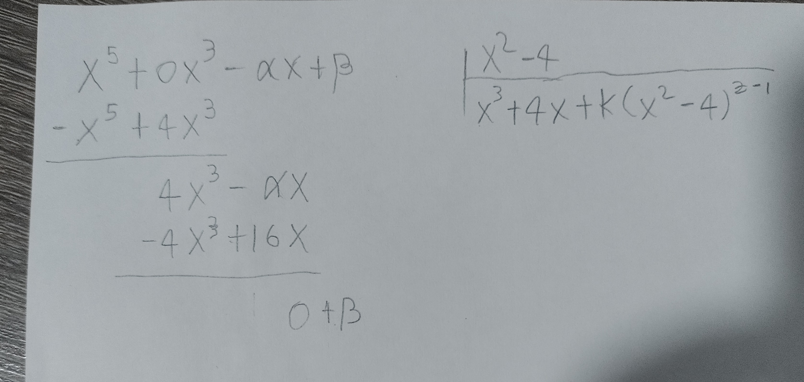
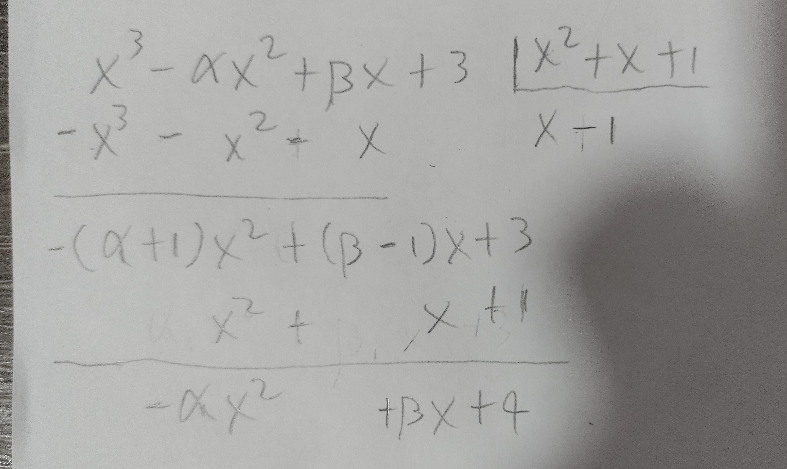
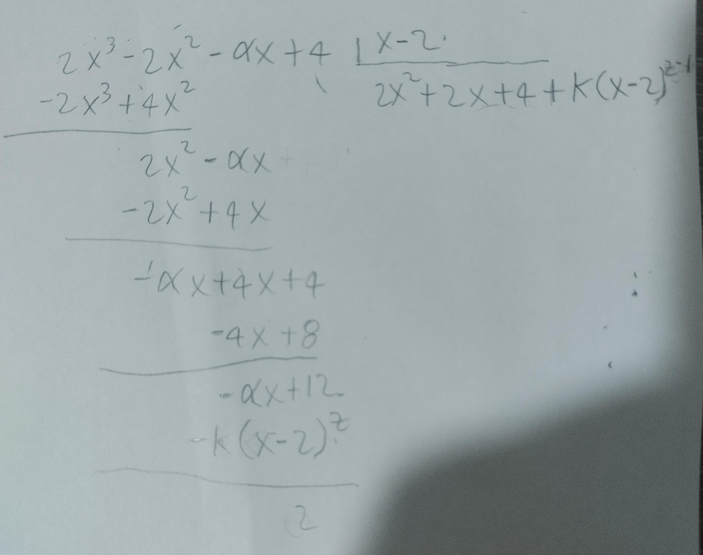

```{r setup, include=FALSE}
knitr::opts_chunk$set(echo = TRUE, comment = NA)

#Anclar con el ambiente de python
library(reticulate)
use_virtualenv('../../../.env', required=TRUE)


library(Ryacas)
```

## Pregunta 1

¿Son las siguientes expresiones algebraicas polinomios en $\mathbb{R}[x]$? En caso afirmativo, ¿qué grado tienen?

- $1+x+x^2+x^3+x^4+\cdots+x^n$ Es un polinomio de grado $n$.
- $1+\frac{1}{x}+x^2+\frac{1}{x^3}$ no es un polinomio ya que algunos términos tienen exponente negativo.
- $1-x^{-2}$ no es un polinomio ya que algunos términos tienen exponente negativo.
- $\sqrt{x}+3$ no es un polinomio ya que algunos términos no tienen como exponente un natural.
- $x+x^2i$
- $(x+1)^2$ representa un polinomio de grado 2.
- $x+x^5+x^{10001}$ es un polinomio de grado 10001.

## Pregunta 2

Hallar $\alpha$ y $\beta$ para que $x^5-\alpha x+\beta$ sea divisible entre $x^2-4$.



$-\alpha x + \beta = -16x + k(x^2-4)^{z}$ donde $k \in \mathbb{N}$ y $z \in \mathbb{N} - \lbrace 0 \rbrace$

\newpage

## Pregunta 3

Hallar $\alpha$ y $\beta$ para que $x^3-\alpha x^2+\beta x+3$ sea divisible entre $x^2+x+1$


$-\alpha x^2 + \beta x + 4 - k(x^2-4)^{z} = 0$ donde $k \in \mathbb{N}$ y $z \in \mathbb{N} - \lbrace 0 \rbrace$

\newpage

## Pregunta 4

Encontrar el valor de $\alpha$ para que al dividir $2x^3-2x^2-\alpha x+4$ entre $x-2$ dé resto 2


$-\alpha x + 12 - k(x - 2)^{z} = 2$ donde $k \in \mathbb{N}$ y $z \in \mathbb{N} - \lbrace 0 \rbrace$

$$-\alpha x + 12 - k(x - 2)^{z} = 2$$
$$\alpha = \frac{2 - 12 + k(x - 2)^{z})}{x} = \frac{-10 + k(x - 2)^{z}}{x}$$

## Pregunta 5

Determinar el valor de $\alpha$ para que $2x^3-2x^2-\alpha x+4$ admita $x = 2$ como una de sus raíces

Para que admita $x = 2$ como una raíz $2x^3-2x^2-\alpha x+4$ debe de ser divisible entre $x-2$. Haciendo el mismo ejercicio 4 pero igualando a $0$.

$-\alpha x + 12 - k(x - 2)^{z} = 0$ donde $k \in \mathbb{N}$ y $z \in \mathbb{N} - \lbrace 0 \rbrace$

$$\alpha = \frac{0 - 12 + k(x - 2)^{z})}{x} = \frac{-12 + k(x - 2)^{z}}{x}$$

## Pregunta 6

Dados los polinomios $$p(x) = x^4-6x+1\qquad q(x) = 3x^3-5x\qquad r(x) = x^4-x^2+2$$

```{r}
p = "x ^ 4 - 6 * x + 1"
q = '3 * x ^ 3 - 5 * x'
r = 'x ^ 4 - x ^ 2 + 2'
```


Realizar las siguientes operaciones

- $p(x)+3q(x)+r(x)$

```{r}
result = paste(p, '+3*(', q, ')+', r)

x = result %>% y_fn("Simplify") %>% y_fn("TeXForm") %>% yac_str()
```

$$p(x)+3q(x)+r(x) = `r x`$$

- $p(x)-[q(x)+5r(x)]$

```{r}
result = paste('(', p, ') - ((', q, ') + 5 * (', r,'))')

x = result %>% y_fn("Simplify") %>% y_fn("TeXForm") %>% yac_str()
```

$$p(x)-[q(x)+5r(x)] = `r x`$$

- $p(x)+q(x)*r(x)$

```{r}
result = paste('(', p, ') + (', q, ') * (', r,')')

x = result %>% y_fn("Simplify") %>% y_fn("TeXForm") %>% yac_str()
```

$$p(x) + q(x) * r(x) = `r x`$$

- $[4p(x)+q(x)]*r(x)$

```{r}
result = paste('(4 * (', p, ') + (', q, ')) * (', r,')')

x = result %>% y_fn("Simplify") %>% y_fn("TeXForm") %>% yac_str()
```

$$[4p(x)+q(x)] \cdot r(x) = `r x`$$

- $\frac{p(x)}{q(x)}-r(x)$

```{r}
result = paste('((', p, ') / (', q, ')) - (', r,')')

x = result %>% y_fn("Simplify") %>% y_fn("TeXForm") %>% yac_str()
```

$$\frac{p(x)}{q(x)}-r(x) = `r x`$$


- $\frac{p(x)}{r(x)} \cdot 2q(x)$

```{r}
result = paste('((', p, ') / (', r, ')) / 2 * (', q,')')

x = result %>% y_fn("Simplify") %>% y_fn("TeXForm") %>% yac_str()
```

$$\frac{p(x)}{r(x)} \cdot 2q(x) =`r x`$$

Finalmente, en cada uno de los polinomios resultantes, evaluar en $0$, $-2$ y $2$


## Pregunta 7

Dividir 

- $x^7-x^5+x^2-3$ entre $x^4+x^3+x^2+x$

```{r}
result = "(x^7-x^5+x^2-3) / (x^4+x^3+x^2+x)"

x = result %>% y_fn("Simplify") %>% y_fn("TeXForm") %>% yac_str()
```

$$\frac{x^7-x^5+x^2-3}{x^4+x^3+x^2+x}=`r x`$$


- $x^8+x^7-3x^6+x^5+2x^4+-3x^3+x^2-x-10$ entre $x^4+x^3-x^2+x+1$

```{r}
result = "(x^8+x^7-3*x^6+x^5+2*x^4+-3*x^3+x^2-x-10)/(x^4+x^3-x^2+x+1)"

x = result %>% y_fn("Simplify") %>% y_fn("TeXForm") %>% yac_str()
```

$$\frac{x^8+x^7-3x^6+x^5+2x^4+-3x^3+x^2-x-10}{x^4+x^3-x^2+x+1}=`r x`$$
- $x^6-x^5+x^4-x^3+x^2-x+1$ entre $x+1$

```{r}
result = "(x^6-x^5+x^4-x^3+x^2-x+1)/(x+1)"

x = result %>% y_fn("Simplify") %>% y_fn("TeXForm") %>% yac_str()
```

$$\frac{x^6-x^5+x^4-x^3+x^2-x+1}{x+1}=`r x`$$

Finalmente, en cada uno de los polinomios resultantes, evaluar en $1$, $2$ y $3$
