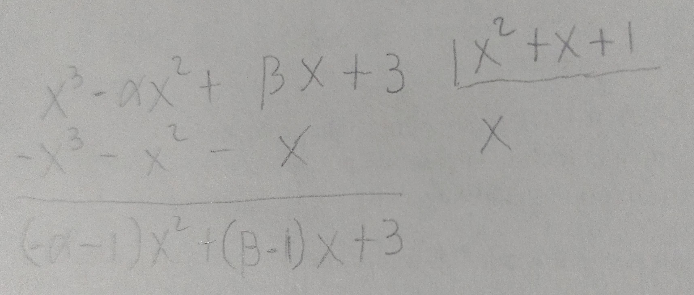

**\mbox{\boldmath Hallar $\alpha$ y $\beta$ para que $x^3-\alpha x^2+\beta x+3$ sea 
divisible entre $x^2+x+1$, $\forall x$.}**

Para hacer este proceso es necesario que el grado del polinomio residuo de la 
división sea igual o menor al grado del polinomio divisor. 

.

Se podría seguir reduciendo el residuo restándole $(- \alpha -1)(x^2+x+1)$, pero 
creo que seria complicarnos la existencia.

Para que el polinomio $x^3-\alpha x^2+\beta x+3$ sea divisible entre $x^2+x+1$, 
el residuo encontrado debe de ser múltiplo de $x^2+x+1$. Por lo tanto,

$$
(-\alpha - 1)x^2 + (\beta -1)x + 3 = k(x^2+x+1)
$$ 

donde $k \in \mathbb{R}$.

Reescribiendo la expresión,

$$
(-\alpha - 1)x^2 + (\beta -1)x + 3 = kx^2 + kx + k
$$ 

Como la expresión se debe de cumplir $\forall x$, entonces $\alpha$ y $\beta$ no
deben depender de $x$.

Se generan las siguientes ecuaciones al igualar los coeficientes para 
deshacernos de la $x$.

$$
k = -\alpha - 1 \qquad
k = \beta - 1   \qquad
k=3
$$
\newpage

Al sustituir la $k$ por el $3$ obtenemos.

$$
3 = -\alpha - 1 \qquad
3 = \beta - 1
$$

Por consiguiente,

$$
\begin{array}{ccl}
     \alpha & = & -3-1
  \\ \alpha & = & -4
\end{array}
$$

$$
\begin{array}{ccl}
     \beta & = & 3+1
  \\ \beta & = & 4
\end{array}
$$

